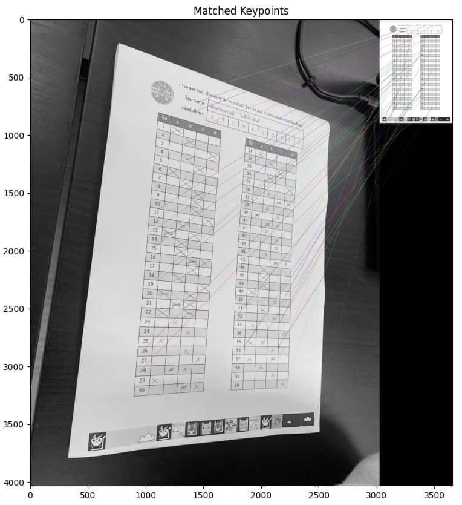
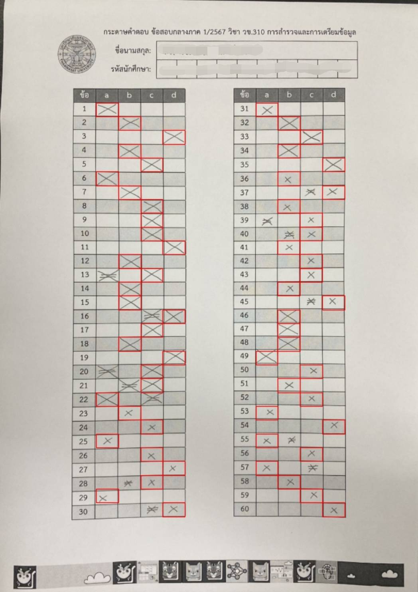
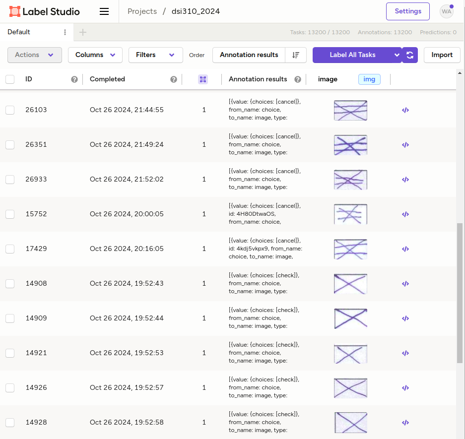

# myocr
Welcome to myocr! Let's grade your answer sheets.

## Setup

```
pip install myocr
```

## Forword
Please go to [notebooks](notebooks) and run demo.ipynb
1. the demo_input.pdf in extracted to pages
2. each page is processed by image registration
3. all bounding boxes are classified to 3 classes (miss, check and cancel)

{: width="50%"}
{: width="50%"}

## Train

{: width="50%"}
The demo notebook provide retrain process.
Note that you need to run Label Studio before retaining.

```
docker-compose up
```